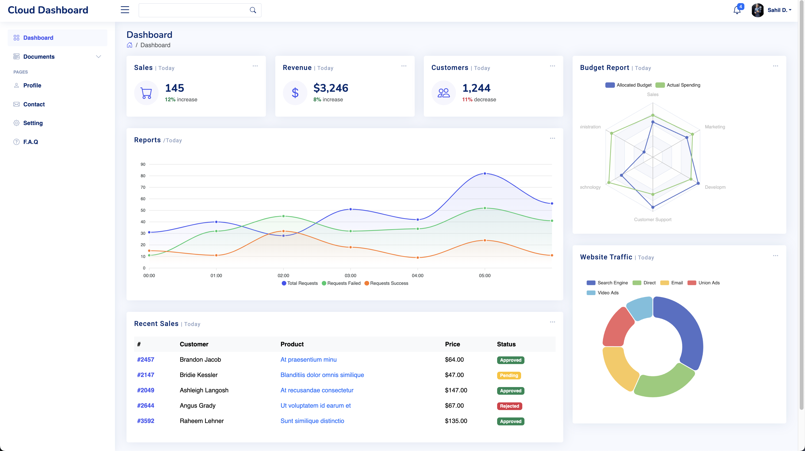

# Cloud Admin Dashboard

A React-based admin dashboard to monitor server resources and usage. This dashboard provides real-time insights into various server metrics, helping administrators to manage and optimize server performance.
Currently being created using mock server data.

## Features

- **Real-time Monitoring**: Live updates of server CPU, memory, disk usage, and network activity.
- **Interactive Charts**: Visualize data through various charts and graphs.
- **Alerts and Notifications**: Set thresholds to receive alerts when resources exceed specified limits.
- **User Management**: Manage admin users with different roles and permissions.
- **Responsive Design**: Accessible on both desktop and mobile devices.

## Screenshots



## Installation

To set up the project locally, follow these steps:

### Prerequisites

- [Node.js](https://nodejs.org/) (v14 or higher recommended)
- [npm](https://www.npmjs.com/) or [yarn](https://yarnpkg.com/)

### Steps

1. **Clone the repository**

   ```bash
   git clone https://github.com/SahilDeb/cloud-monitoring-dashboard.git
   cd cloud-monitoring-dashboard
   ```

2. **Install dependencies**

   Using npm:

   ```bash
   npm install
   ```

   Or using yarn:

   ```bash
   yarn install
   ```

3. **Start the mock server**

   Use the following commands to start a mock server with data from the json file.

   ```env
    json-server --watch --port 4000 ./api/info.json
   ```

4. **Set up environment variables**

   Create a `.env` file in the root of the project and add the following environment variable.

   ```env
   REACT_APP_API_URL=http://localhost:4000
   ```

5. **Start the development server**

   Using npm:

   ```bash
   npm start
   ```

   Or using yarn:

   ```bash
   yarn start
   ```

   The app will be available at [http://localhost:3000](http://localhost:3000).

6. **Build for production**

   Using npm:

   ```bash
   npm run build
   ```

   Or using yarn:

   ```bash
   yarn build
   ```

   The production-ready files will be in the `build` directory.

## Usage

- Access the dashboard at [http://localhost:5173](http://localhost:5173).
- Navigate through different sections to monitor CPU, memory, disk, and network usage.

## Contributing

Contributions are welcome! Please follow these steps:

1. Fork the repository.
2. Create a new branch: `git checkout -b feature-name`.
3. Make your changes and commit them: `git commit -m 'Add new feature'`.
4. Push to the branch: `git push origin feature-name`.
5. Create a pull request.

## Contact

For any inquiries or issues, please contact [sahildebnath091195@gmail.com](mailto:sahildebnath091195@gmail.com).
